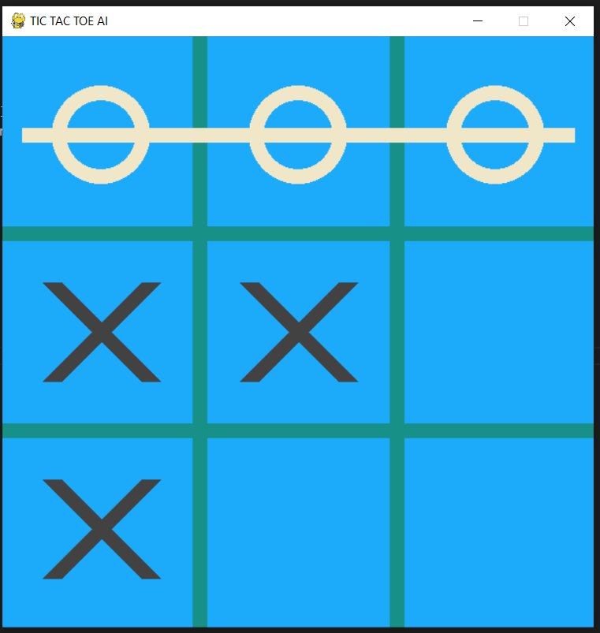
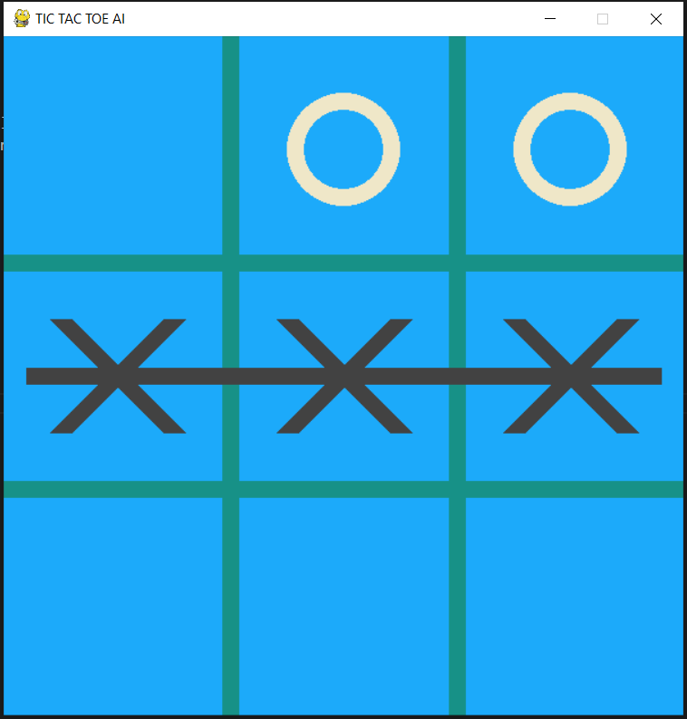
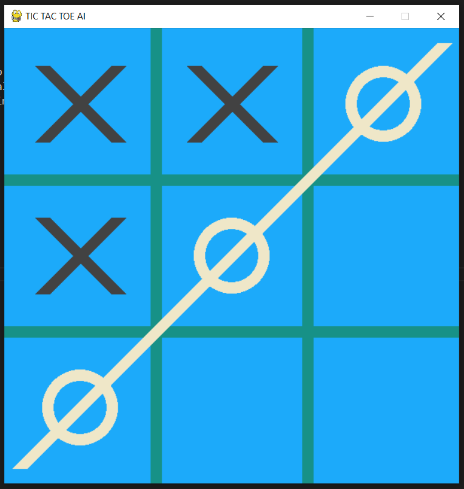

# ProyectoIA_JuegoIA
 Proyecto de Inteligencia Artificia 1
- Juego de AI (TIC TAC TOE con IA )

# Nombres de los desarrolladores:
- Nombre: David Joaquin Ramirez Muñoz
- Carné: 1904002003

- Nombre: Edvid Stuardo Pérez Garcia
- Carné: 1904002011

# Instrucciones Juegos:
- presiona 'g' para cambiar el modo de juego (pvp o ai)
- presione '0' para cambiar el nivel de IA a 0 (aleatorio)
- presione '1' para cambiar el nivel de IA a 1 (imposible)
- presiona 'r' para reiniciar el juego

# Link del Video
- presione el link para ver el video: https://drive.google.com/file/d/1LEM1Bf9A--ZNOehiGwzWLBfw_x8_4SNS/view?usp=drive_link

- presione el linnk para ver el manual tecnico:

## Snapshot 1 - Logic AI

## Snapshot 2 - START GAME

## Snapshot 3 - CIRCULO WIN

## Snapshot 4 - CRUZ WIN

## Snapshot 5 - AI WIN
